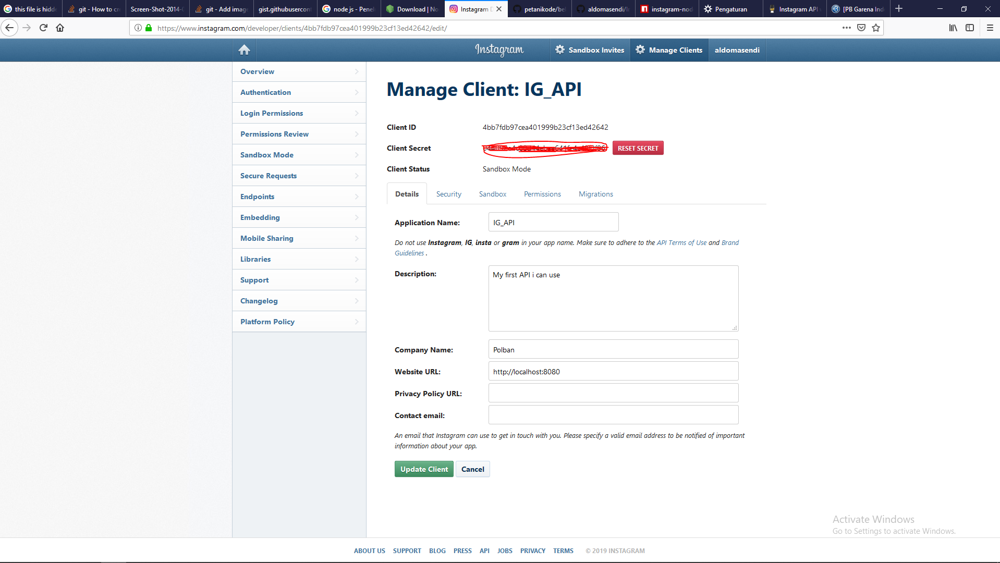
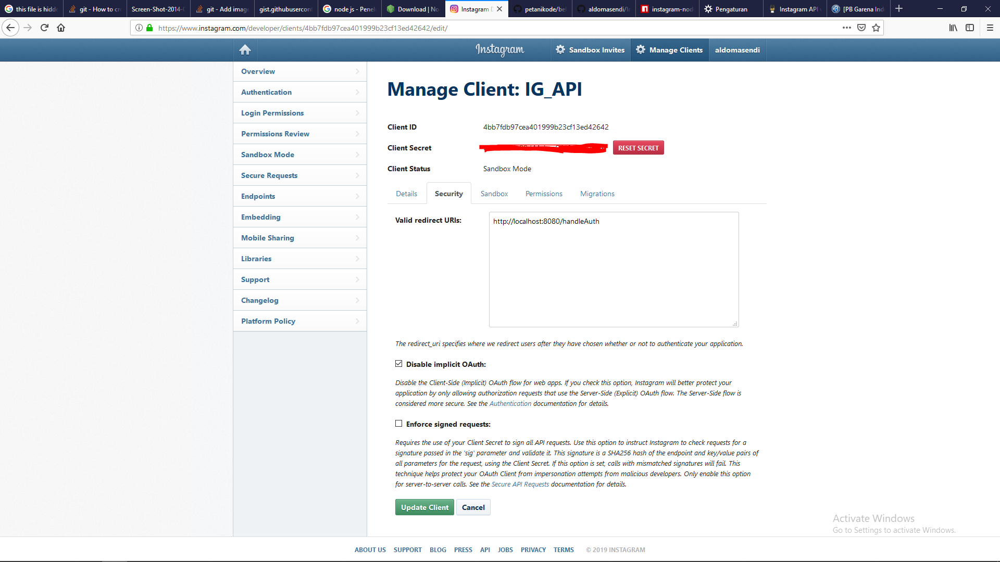
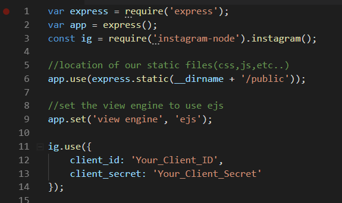

# Instagram-API
Pengembangan aplikasi web menggunakan Instagram-API dan penambahan fitur yang diimplementasi pada web yang kami buat.

Source yang kami pakai diambil pada webiste https://scotch.io/@devGson/using-the-instagram-api-with-node-and-expressjs

sebuah website yang berbasis Instagram API yang hanya menampilkan recent post Instagram dan jumlah like serta jumlah comment.

Setelah kami pahami konsep website nya, kami berhasil menambahkan beberapa fitur pada website tersebut. Berikut cara untuk 
menjalankan aplikasi web tersebut.

## Getting Started

Untuk mengawali project, sebelumnya harus sudah mempunyai atau menginstall [node.js](https://nodejs.org/en/download/) pada komputer dan sudah mendaftarkan aplikasi nya pada [Instagram Developers](https://www.instagram.com/developer/).

Pertama-tama login Instagram terlebih dahulu, berada pada button pojok kanan atas

.png)

Setelah login, klik Manage Clients


Kemudian register new Client, klik Register a New Client


Saat register, masukkan website URL localhost nya. Contoh nya menggunakan localhost dengan port 8080



Kemudian masuk ke Tab **Security** dan masukkan handleAuth nya



Terakhir, klik button **Update Client** dan kita dapatkan **Client ID** dan **Client Secret** nya.

### Installing

Setelah download git, lalu masuk pada directory file tersebut berada pada cmd lalu install.

```
> npm install instagram-node
```

Setelah berhasil menginstall instagram-node, buka **api.js** menggunakan text editor yang disukai. Disana memerlukan **Client_ID** dan **Client_Secret** yang anda punya.



### Running

Step untuk me-run project
```
> node api.js
```

Setelah localhost berjalan, masuk pada browser dan inputkan localhost yang dipakai. Contohnya kami memakai 'localhost:8080'

```
localhost:8080
```
Namun project belum bisa menampilkan websitenya karena AccessToken belum terdefinisikan. Untuk mendapatkan accessToken tersebut, masuk pada directory 'authorize'
```
localhost:8080/authorize
```
Setelah authorize, lalu akan muncul seperti *permission* untuk mengizinkan aplikasi menggunakan instagram API. Setelah diizinkan, maka secara otomatis, akan muncul gambar dan video yang ada pada instagram user tersebut.

## Built With

* [Dropwizard](http://www.dropwizard.io/1.0.2/docs/) - The web framework used
* [Maven](https://maven.apache.org/) - Dependency Management
* [ROME](https://rometools.github.io/rome/) - Used to generate RSS Feeds

## Contributing

Please read [CONTRIBUTING.md](https://gist.github.com/PurpleBooth/b24679402957c63ec426) for details on our code of conduct, and the process for submitting pull requests to us.

## Versioning

We use [SemVer](http://semver.org/) for versioning. For the versions available, see the [tags on this repository](https://github.com/your/project/tags). 

## Authors

Kelompok 1:
* **M. Aldo Masendi** - *161524021*
* **Arizal Pratama T A** - *161524003*
* **Firya Nadhifa** - *161524011*
* **Hilman Fitriana** - *161524013*
* **Ilham Robyana Sofyan** - *161524014*
* **M. Aditia Farhan** - *161524020*
* **Zahra Cesalia** - *161524032*

Kelas 3A/D4-Teknik Informatika POLBAN 2016

## License

This project is licensed under the MIT License - see the [LICENSE.md](LICENSE.md) file for details

## Acknowledgments

* Hat tip to anyone whose code was used
* Inspiration
* etc
